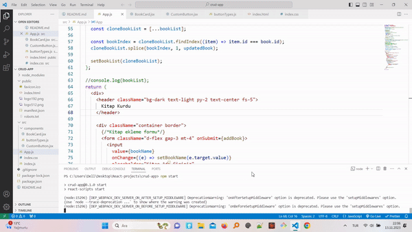

<h1>Crud-app</h1>

Overview
This React CRUD application provides a simple and intuitive user interface for managing a collection of data. With this app, users can perform basic CRUD operations, enabling them to create, read, update, and delete items within the dataset.

Features
Create: Add new items to the dataset using a user-friendly form.
Read: View the entire list of items in a clean and organized layout.
Update: Easily edit existing items with the built-in update form.
Delete: Remove items from the dataset with a single click.

<h3>The technologies used</h3>

React: A JavaScript library for building user interfaces.
npm: The package manager for JavaScript.

Contributing
We welcome contributions! If you'd like to contribute to this project, fork the repository, make your changes, and submit a pull request.

<h3>The screenshot of the project</h3>

